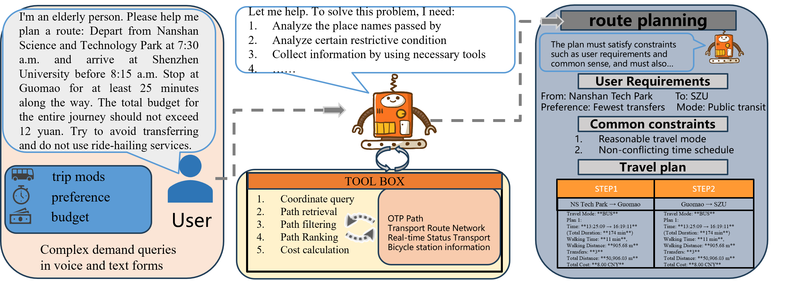

# <h1 align="center">RoutePlanner<br>Benchmark for Evaluating Language Agents on Real-World Urban Route Planning</h1>

<p align="center">
     <br>
</p>

RoutePlanner is a benchmark framework for evaluating how language agents perform on real-world urban route planning tasks, with a particular focus on their combined capability in **tool use** and **multi-constraint reasoning**.

---

## Project Overview

RoutePlanner is designed to systematically evaluate whether language agents can generate complete travel plans under realistic constraints.

For each input query, the model is expected to generate a **reasonable route organized by waypoints**, including the following key elements:

* Travel mode
* Intermediate stops or pass-through points
* Transfer timing

At the same time, the generated plan must satisfy multiple kinds of real-world constraints:

* **Common-sense constraints**: such as reasonable timing and coherent trip structure
* **Hard constraints**: such as origin, destination, budget, time limits, and stated preferences
* **Implicit constraints**: such as minimizing walking for elderly travelers or similar user-specific needs

---

## Key Features

* Evaluates route planning in a realistic city setting rather than simplified synthetic tasks
* Tests both planning quality and the agent's ability to call external tools effectively
* Covers explicit, implicit, and common-sense constraints within a single benchmark
* Supports a complete workflow including generation, post-processing, and evaluation
* Organizes outputs into intermediate and final artifacts for reproducible analysis

---

## Environment Setup

### 1. Build the OTP (OpenTripPlanner) routing platform

The following files are required to build a complete OTP environment:

```bash
otp-2.5.0-shaded.jar   # OTP JAR package
overpass_sz.osm.pbf      # Shenzhen road network
subway_gtfs.zip
new_Gtfs.zip             # Transit data files must end with gtfs.zip
```

We build the routing graph from real transportation data in Shenzhen, convert the transit feeds to the GTFS standard, and validate them using GTFS tooling.

Download the official [OpenTripPlanner project](https://github.com/opentripplanner/OpenTripPlanner) and use version `2.5.0`.

Download the Shenzhen road network data: add the source link here.

Download the Shenzhen public transit data: add the source link here.

Build and load the graph:

```bash
# Build graph.obj from the routing data
java -Xmx4G -jar otp-2.5.0-shaded.jar --build --save ./your_graph_directory

# Load the graph
java -Xmx4G -jar otp-2.5.0-shaded.jar --load ./your_graph_directory
```

If OTP starts successfully, open `http://localhost:8080` to query routes.

### 2. Create the Conda environment and install dependencies

```bash
conda create -n RoutePlanner python=3.9
conda activate RoutePlanner
pip install -r requirements.txt
```

Current Python dependencies listed in `requirements.txt` include `langchain`, `pandas`, `tiktoken`, `openai`, `langchain_google_genai`, `gradio`, `datasets`, and `func_timeout`.

---

## Repository Structure

A high-level view of the main directories:

```text
RoutePlanner/
├── agents/          # Agent execution entry points and planning logic
├── preprocess/    # Data generation and preprocessing scripts
├── postprocess/     # Parse natural-language plans into structured outputs
├── evaluation/      # Evaluation scripts for validation and analysis
├── database/        # Data resources used by the planner pipeline
├── tools/           # Routing and utility tool modules
├── utils/           # Shared helper functions
├── frontend/        # Frontend-related code
├── finetune/        # Fine-tuning related assets and experiments
```


---

## Data Generation Stage

Before agent evaluation , the repository also supports a data generation stage for constructing route-planning instructions and tool-execution traces.

In the current codebase, this stage is mainly implemented in `preprocess`:

* `preprocess/query_generate.py`: generates or rewrites natural-language route-planning queries from structured inputs
* `preprocess/generated_plan.py`: converts structured route records into step-by-step tool plans such as `Wgs84Search`, `RouteSearch`, `RouteRanking`, and `Planner`

Conceptually, the stage can be viewed as a three-step pipeline:

1. Start from structured travel records or benchmark annotations.
2. Generate user-facing natural-language queries and corresponding executable planning traces.


Typical artifacts produced in this stage include:

* Query CSV files containing generated user requests
* Intermediate CSV files containing structured plans or execution steps
* Final JSONL files such as `finetune/dataset.jsonl` for training

This stage is not required for simply running the benchmark on the released validation or test split, but it is useful when you want to:

* reproduce the data construction workflow,
* build additional supervised fine-tuning data, or
* inspect how natural-language route queries are aligned with tool-level planning trajectories.

### Example workflow

The exact input file names in the scripts are currently hard-coded, so you may need to adjust paths before running them. A typical workflow is:

```bash
cd preprocess
python query_generate.py
python generated_plan.py

```

## Running the Pipeline

### End-to-End Execution

In end-to-end execution, the language agent first extracts parameters and then invokes tools to generate a comprehensive plan that satisfies the user's requirements and constraints.

```bash
export OUTPUT_DIR=path/to/your/output/file

# Example values: gpt-3.5-turbo-X, gpt-4-1106-preview, gemini, mistral-7B-32K, mixtral
export MODEL_NAME=MODEL_NAME

export OPENAI_API_KEY=YOUR_OPENAI_KEY

# Optional: validation or test
export SET_TYPE=validation

cd agents
python tool_agents.py \
  --set_type $SET_TYPE \
  --output_dir $OUTPUT_DIR \
  --model_name $MODEL_NAME

The planning phase proceeds as described above; however, `set_type` is set to `args`, allowing for the direct reading of raw parameters. This ensures that planning is executed only after semantic correctness has been fully verified.
```

The generated outputs are stored in:

```text
OUTPUT_DIR/SET_TYPE
```

### Alternative entry points

The repository contains more than one runnable agent script. Based on the current codebase, the most relevant entry points include:

* `agents/tool_agents.py`
* `agents/app.py`

For the documented benchmark workflow, `agents/tool_agents.py` is the primary script already used in the existing README commands.

---

## Post-processing

This stage parses the generated natural-language travel plan into structured JSON and combines the intermediate results into the final evaluation file.

```bash
export OUTPUT_DIR=path/to/your/output/file
export MODEL_NAME=MODEL_NAME
export OPENAI_API_KEY=YOUR_OPENAI_KEY
export SET_TYPE=validation
export STRATEGY=direct

# Mode: two-stage or sole-planning
export MODE=two-stage

export TMP_DIR=path/to/tmp/parsed/plan/file
export SUBMISSION_DIR=path/to/your/evaluation/file

cd postprocess

python parsing.py \
  --set_type $SET_TYPE \
  --output_dir $OUTPUT_DIR \
  --model_name $MODEL_NAME \
  --strategy $STRATEGY \
  --mode $MODE \
  --tmp_dir $TMP_DIR

python element_extraction.py \
  --set_type $SET_TYPE \
  --output_dir $OUTPUT_DIR \
  --model_name $MODEL_NAME \
  --strategy $STRATEGY \
  --mode $MODE \
  --tmp_dir $TMP_DIR

python combination.py \
  --set_type $SET_TYPE \
  --output_dir $OUTPUT_DIR \
  --model_name $MODEL_NAME \
  --strategy $STRATEGY \
  --mode $MODE \
  --submission_file_dir $SUBMISSION_DIR
```

### Expected artifacts

After post-processing, you should expect several layers of artifacts:

* Raw model outputs generated by the agent
* Parsed intermediate files stored in `TMP_DIR`
* Combined structured files prepared for evaluation or submission

Keeping these artifacts separated makes it easier to debug formatting issues, extraction failures, and evaluation mismatches.

---

## Evaluation

Use the local validation set for evaluation:

```bash
export SET_TYPE=validation
export EVALUATION_FILE_PATH=your/evaluation/file/path

cd evaluation
python eval.py \
  --set_type $SET_TYPE \
  --evaluation_file_path $EVALUATION_FILE_PATH
```

### Evaluation goal

The evaluation stage measures whether the generated route satisfies the benchmark requirements in a structured and reproducible way. In practice, this means checking whether the model output can be converted into the expected format and whether the planned route respects the intended constraints.

---


## Recommended Workflow

For a clean benchmark run, the practical workflow is:

1. Prepare and validate the OTP routing backend.
2. Create the Python environment and install dependencies.
3. Run the agent script to generate route plans.
4. Post-process the natural-language outputs into structured JSON-like artifacts.
5. Run the evaluation script on the resulting file.
6. Inspect intermediate outputs if parsing or evaluation errors occur.

---

## Notes and Constraints

This benchmark is intended to provide a fair and reproducible evaluation environment. Please strictly follow these rules:

1. Do not optimize model performance by reverse-engineering the dataset construction rules.
2. Do not hard-code benchmark-specific information into prompts.
3. Do not rely on handcrafted strategies that only work for this benchmark and do not generalize.

---
